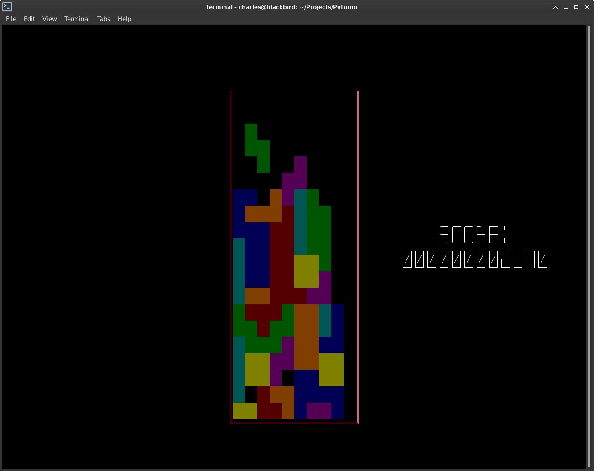
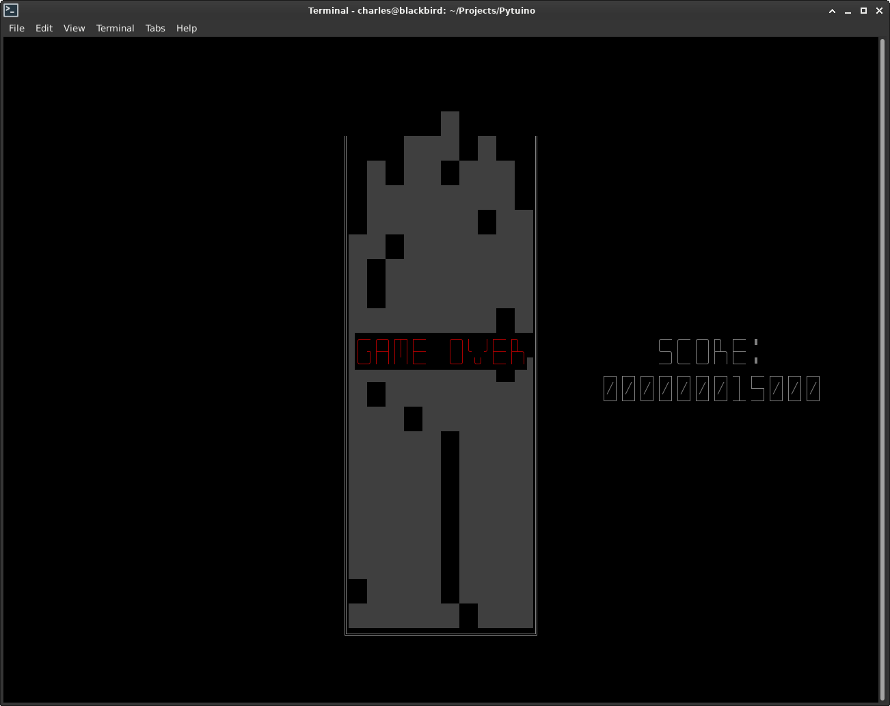

# Pytuino
Python implementation of Tetris using only the text console.

## Introduction
I had an idea for a Tetris project but wanted to try out a few details first, namely can you run it reasonably over a serial (RS232) link. Obviously such a link can not support a graphical display as such, but could provide a character (TUI) display.

## Phase I

  

## Phase II

## Todo

